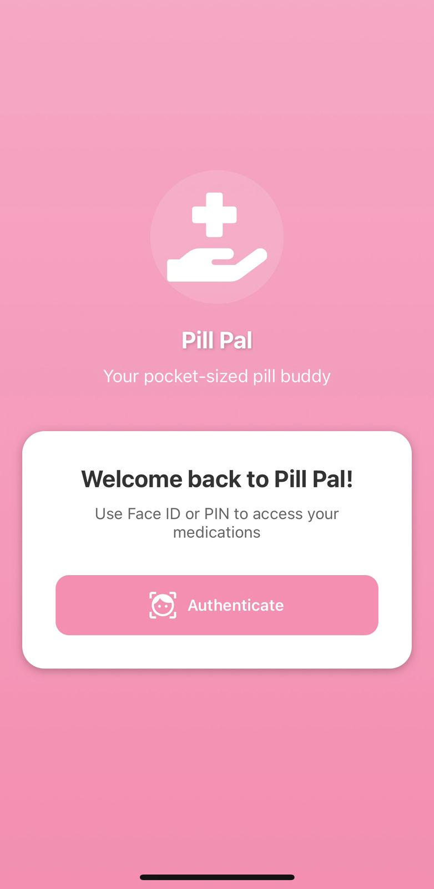
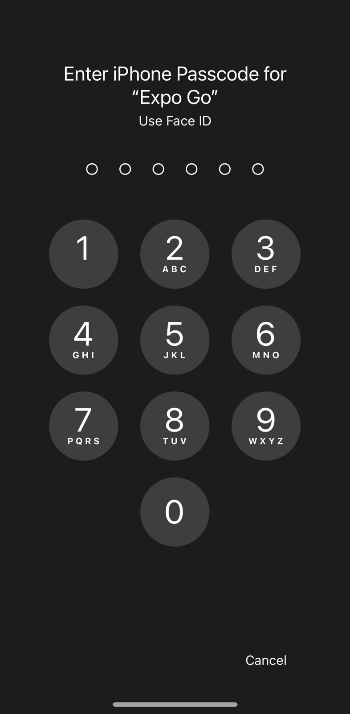
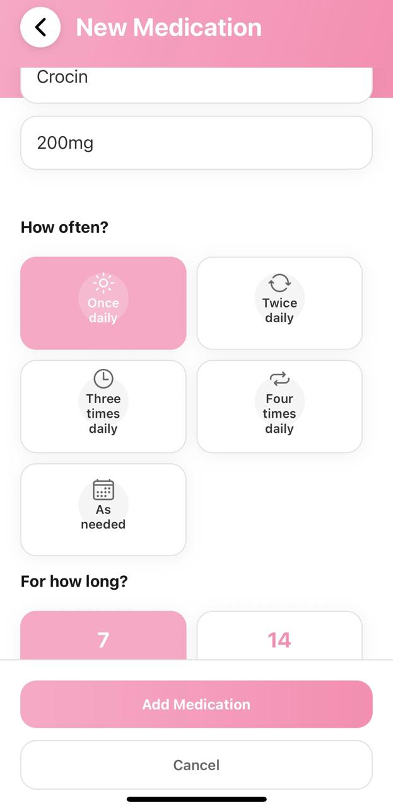
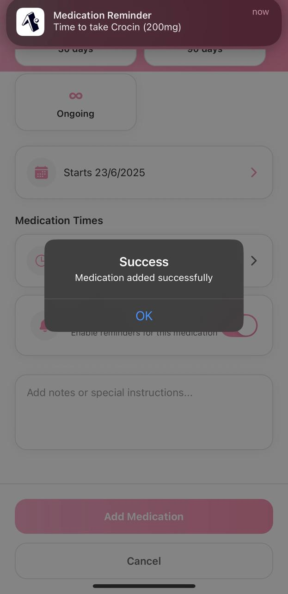
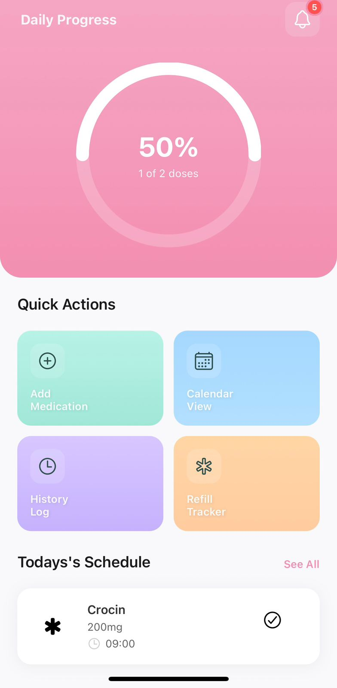
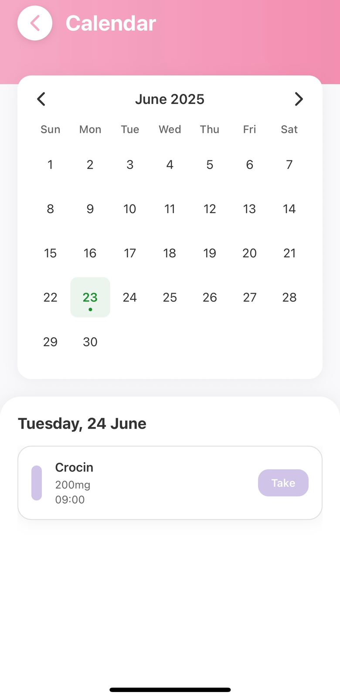
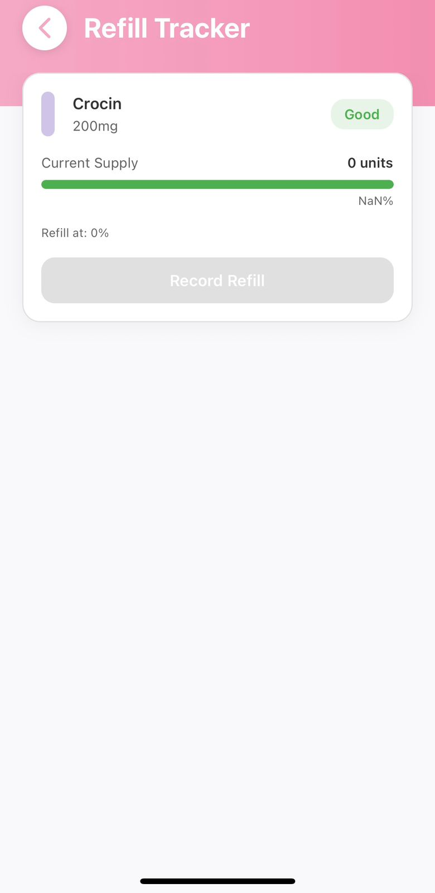
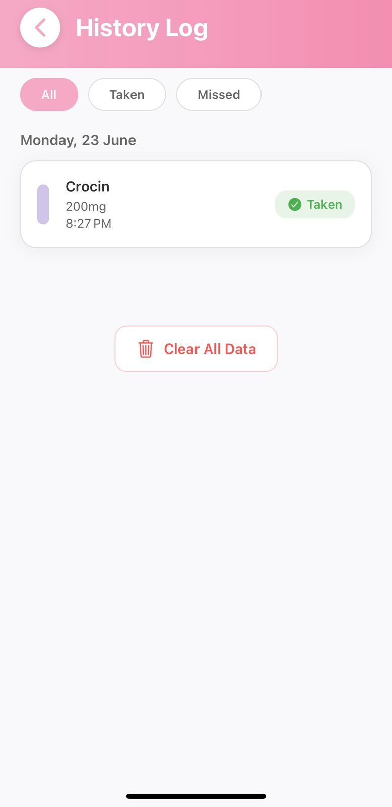

# 💊 Pill-Pal

**Pill-Pal** is a cross-platform medication management app built with React Native and Expo. It helps users stay on top of their health by offering custom medication reminders, refill tracking, biometric authentication, and a sleek, modern interface.

---

## ✨ Features

- ⏰ **Medication Scheduling** – Set custom times for reminders and doses  
- 📦 **Refill Tracking** – Get low supply alerts and manage stock levels  
- 📲 **Cross-Platform Compatibility** – Works seamlessly on both Android and iOS  
- 🔒 **Biometric Authentication** – Secure access using Face ID or Touch ID  
- 📈 **Progress Tracking** – Log daily medication intake and visualize adherence  
- 📅 **Calendar Integration** – View and manage upcoming doses in a calendar format  
- 🔐 **Secure Local Storage** – Uses AsyncStorage for on-device data persistence  

---

## 🛠️ Tech Stack

| Technology             | Purpose                                |
|------------------------|----------------------------------------|
| **React Native**       | Cross-platform mobile app framework    |
| **Expo**               | Rapid development and deployment       |
| **TypeScript**         | Type-safe JavaScript                   |
| **React Navigation**   | Screen navigation and routing          |
| **Expo Notifications** | Local push notifications               |
| **AsyncStorage**       | Local storage of user data             |
| **Reanimated**         | Smooth and performant animations       |

---

## 📚 What You'll Learn

- Fundamentals of **React Native** and **Expo**
- Integrating **biometric authentication** (Face ID/Touch ID)
- Implementing **local push notifications**
- Managing **local data securely** with AsyncStorage
- Designing **calendar-based scheduling systems**
- Structuring a mobile app with **clean UI/UX principles**
- Creating **cross-platform responsive interfaces**

---

## 🧪 Project Highlights

- Medication reminder system with **custom time slots**
- Refill tracking with **real-time alerts**
- Daily progress **visualized through UI elements**
- Secure user authentication using **biometric methods**
- Calendar interface for **dose tracking and management**
- Clean, modern, and responsive **mobile UI design**

---

## 🚀 Getting Started

To run this project locally:

1. **Clone the repository**
   ```bash
   git clone https://github.com/yourusername/pill-pal.git
   cd pill-pal


## 📸 App Screenshots

### 🔐 Authentication Page  


### 🔓 iPhone Lock Screen (Password Entry)  


### ➕ Add Medication Page  


### ✅ Medication Added Successfully  


### ⚡ Quick Actions Page  


### 🗓️ Calendar View  


### 💊 Refill Tracker Page  


### 📜 History Log Page  


